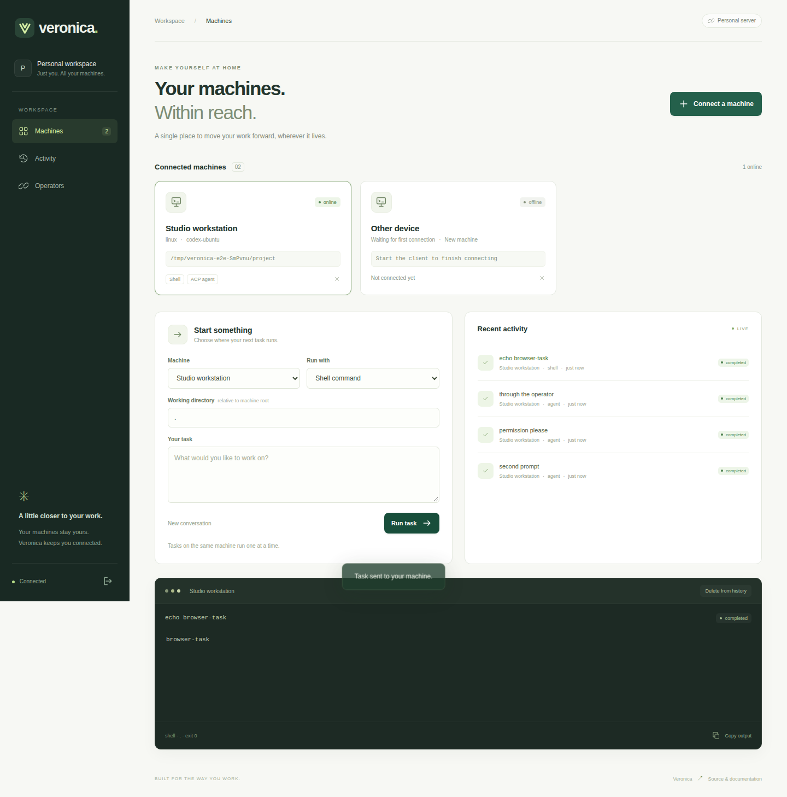
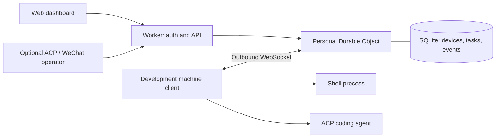

# Veronica

**Your machines. Within reach.**

Veronica 是部署在你自己 Cloudflare 账号中的个人开发机器控制台。打开网页，选择一台电脑或服务器，运行 Shell 命令或向 coding agent 下发任务，实时查看输出、处理权限请求和取消任务。

[](https://deploy.workers.cloudflare.com/?url=https://github.com/bttb2020/veronica)
[](https://github.com/bttb2020/veronica/actions/workflows/checks.yml)

Server: **this repository** · Execution client: **[veronica-client](https://github.com/bttb2020/veronica-client)**



不依赖飞书。Web 是第一方入口；[wechat-acp](https://github.com/formulahendry/wechat-acp) 可以通过 client 提供的 ACP stdio 适配器，作为可选的微信入口。

## 能做什么

- 注册、查看和撤销多台开发机器；每台机器有独立凭据。
- 运行 Shell 命令，或调用本机安装的 ACP coding agent。
- 实时输出、任务历史、取消任务、同机顺序执行。
- 设备离线时持久化排队；重连后补传已有输出并继续调度。
- 同一个 agent 会话在 client 进程存活期间保留上下文。
- 在 Web 中批准或拒绝 ACP agent 的权限请求。
- 为外部操作器签发限定到一台设备的可撤销令牌。
- 桌面和手机浏览器布局。

## 一键部署

1. 点击 **Deploy to Cloudflare**。Cloudflare 会复制仓库，创建 Worker 与 SQLite Durable Object，并构建 Web 资源。
2. 在部署表单中设置 `ADMIN_TOKEN`，使用至少 32 个随机字符。可以在本机执行 `openssl rand -hex 32` 生成。
3. 部署完成后打开 Worker URL，用这个密钥登录。
4. 点击 **Connect a machine**，在目标电脑上执行页面提供的安装、配对和启动命令。

`.dev.vars.example` 让部署流程发现必需的 secret。示例值无法用于登录：未配置有效密钥时 API 会拒绝服务。不要把真实密钥写进 Git、`wrangler.jsonc` 或 Web 构建变量。

默认只需要一个 Worker 和一个 Durable Object，不需要另建数据库、云主机或消息平台应用。部署仍需你的 Cloudflare 登录，并遵循你账号的资源额度和计费。

### 手动部署

```bash
git clone https://github.com/bttb2020/veronica.git
cd veronica
npm ci
npx wrangler login
npx wrangler secret put ADMIN_TOKEN
npm run deploy
```

### 连接开发机器

需要 **Node.js 22+** 和 npm。先在网页中获取一个 10 分钟有效、只能使用一次的配对码：

```bash
npm install -g https://github.com/bttb2020/veronica-client/releases/download/v0.1.1/bttb2020-veronica-client-0.1.1.tgz
cd /path/to/your/projects
veronica-client pair \
  --server https://veronica.YOUR-SUBDOMAIN.workers.dev \
  --code YOUR_ONE_TIME_CODE \
  --root . \
  --allow-shell
veronica-client start
```

安装直接下载 GitHub Release 中已构建的 client，不需要 Git、TypeScript 编译器或 npm 发布账号。也可以从 [client Releases](https://github.com/bttb2020/veronica-client/releases) 手动下载 `.tgz` 后用 `npm install -g ./文件名.tgz` 安装。

如果使用 coding agent，在配对时配置其 ACP 启动命令：

```bash
veronica-client pair \
  --server https://YOUR-VERONICA-SERVER \
  --code YOUR_ONE_TIME_CODE \
  --root /path/to/projects \
  --agent-command '["your-acp-agent", "--acp"]'
```

`your-acp-agent` 是你已安装并授权的 ACP agent 程序，请替换为该 agent 官方支持的命令和参数。`--allow-shell` 与 `--agent-command` 可以同时配置。完整安装、自启动和多 profile 说明见 [client 文档](https://github.com/bttb2020/veronica-client#readme)。

## 微信操作器

微信登录和轮询运行在一台常开的电脑上；可与执行机器相同，也可分开部署。Cloudflare server 不需要微信凭据。

1. 目标机器配置并运行 ACP agent executor。
2. 在 Web 的 **Operators** 页面创建一个绑定该机器的令牌。
3. 在操作器电脑上安装 `veronica-client`，将令牌保存到仅自己可读的文件，然后配置：

```bash
veronica-client operator \
  --server https://YOUR-VERONICA-SERVER \
  --device YOUR_DEVICE_ID \
  --token-stdin < /path/to/private-operator-key.txt

npx -y wechat-acp --agent "veronica-client acp"
```

按 wechat-acp 的终端提示扫码。链路为：

```text
WeChat → wechat-acp → veronica-client acp
       → Veronica API → device WebSocket → local ACP agent
```

v0.1 转发文本请求和文本结果；权限请求仍需在 Web 控制台处理，Veronica 不会采用 wechat-acp 的自动批准行为。微信侧下载的附件路径不会变成远端机器的本地文件；跨机器附件传输尚未实现。我们测试了 ACP 适配器的完整协议链路，真实微信扫码和消息投递需要可用的 iLink 账号环境。

## 架构与可靠性



本机主动建立出站 TLS WebSocket；不用暴露端口。DO 使用 WebSocket Hibernation，并通过自动应答处理心跳。空闲连接不需要依靠定时器让 DO 常驻内存。Web 请求和实际任务事件会唤醒它。

任务在调度前入库；同一台设备一次执行一个任务。client 在启动进程前写本地日志，输出按序号持久化后上传；重连会重新投递正在进行的任务，由本地日志去重并补传输出。主动断网不会停止本地执行。client 重启后，未确认完成的任务被标记为 `interrupted`，需要你检查可能已经发生的本地变更。

网络协议支持至少一次投递与去重，不承诺任意 Shell 副作用的 exactly-once。client 的目录边界检查限定启动工作目录，**不构成进程沙箱**：启用的 Shell 和 agent 仍拥有运行 client 的系统用户权限。

更多内容：[协议与 API](docs/protocol.md) · [运行与维护](docs/operations.md)

## 本地开发与验证

```bash
# 两个仓库放在同一父目录
git clone https://github.com/bttb2020/veronica-client.git ../veronica-client
cd ../veronica-client && npm ci
cd ../veronica
npm ci
cp .dev.vars.example .dev.vars
# 编辑 .dev.vars，替换 ADMIN_TOKEN 为随机密钥
npm run dev
```

```bash
npm run check
npm test
npm run build
npm run test:e2e

# 加上真正的浏览器验证
npx playwright install chromium
VERONICA_BROWSER=1 npm run test:e2e
```

端到端测试启动真实本地 Workers / Durable Objects 运行时与 client，覆盖登录、一次性配对、远程执行、重复请求、离线补传、排队、取消、ACP 会话、权限审批、操作器隔离和设备撤销。ACP agent 使用确定性 fixture，无需模型密钥。设置 `VERONICA_CLIENT_DIR` 可指定 client checkout；`VERONICA_ARTIFACT_DIR` 可保存浏览器截图。

## v0.1 的边界

- 个人单管理员服务，单个 workspace，最多 100 台已注册设备；不包含团队 RBAC。
- 同时最多 100 个未完成任务；历史保留上限为 1,000 个任务，达到后可在 Web 删除已结束任务。
- 单次输入最多 32,000 字符；client 输出上限约 1,000,000 字符；任务默认超时 30 分钟。
- 非交互式命令执行；暂不提供终端 PTY、网页预览隧道、文件浏览或远程桌面。
- ACP 会话在 client 内存中保留，最多 10 个；重启或淘汰后的会话会以新上下文启动并提示。尚未实现 agent 会话的跨重启恢复。
- Agent v0.1 适配器不宣告 ACP 客户端文件系统或终端能力；请使用能自行访问本机工具的 agent。
- 在 Linux 环境验证了执行与浏览器链路；macOS / Windows 提供安装说明和进程处理分支，尚未在真实设备完成验证。
- 官方云端部署流程已配置，测试使用本地 Cloudflare 运行时；实际部署和微信账号登录由实例所有者完成。

MIT License.
